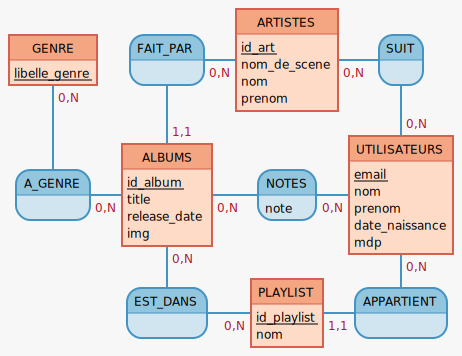
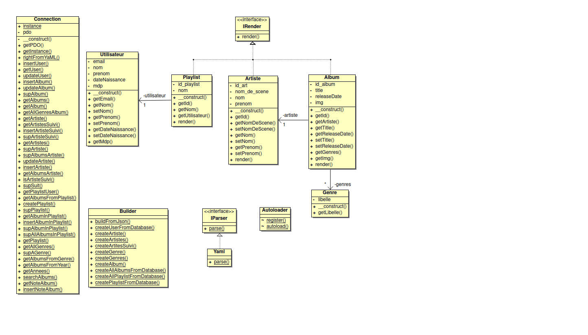

# SAE 4.01 Web - PHP
Équipe : AVIGNON Théo, RABILLON Thomas, YANG Evann

Enseignant : M.ARSOUZE

Lien GitHub : https://github.com/ThomasRABILLON/SAE_PHP, le dépôt est public

## Lancement du projet

Notre projet ne contient aucune dépendance, ainsi pour le lancer il suffit juste d'utiliser la commande :
```bash
php -S localhost:5000
```

## Fonctionnalité implémenter

Utilisateurs :
- Création de compte utilisateur
- Connexion compte utilisateur (l'utilisateur est stocker dans la session)
- Modification du profil utilisateur
- Création de multiple playlist personnel
- Possibilité de suivre des artistes

Albums :
- Affichage de tous les albums
- Détails des albums
- Ajout d'un album dans une playlist utilisateur
- Système de notation simple des albums
- Dans l'admin (url: /admin), création, modification et suppression des albums
- Dans l'admin (url: /admin), possibilité d'importer les albums depuis le YAML fourni. Cela créera aussi les genres et artistes associé

Artistes :
- Détails des artistes avec ses albums
- Possibilité d'être suivi par des utilisateurs
- Dans l'admin (url: /admin), création, modification et suppression des artistes
- Dans l'admin (url: /admin), lorsque les albums sont importés depuis le YAML les artistes sont créés automatiquement

Recherche :
- Possibilité de faire des recherches par nom d'album
- Possibilité de faire des recherches par artiste
- Possibilité de faire des recherches par genre
- Possibilité de faire des recherches par année

## MCD



## Diagramme de classe

